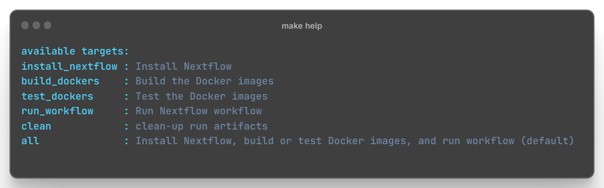
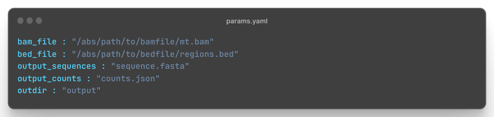

# Project

This project is a template that can be used to set up bioinformatics pipelines using  [Nextflow](https://www.nextflow.io/). 

This pipeline uses Nextflow pipeline to count reads from a BAM file (with respect to the regions provided in the BED file) and also converts regions specified in the bed file to a FASTA file

## Input Files

#### BAM file

Input BAM can be obtained at [Tiny Bam](https://github.com/brainstorm/tiny-test-data/blob/master/wgs/mt.bam).

#### BED file

BED file is located in `input/regions.bed.gz`.,M

### Output

Using [Nextflow](https://www.nextflow.io/) 

1. Read counts for the regions specified in the provided BED file outputed as JSON.
2. Extracts reads in the regions and convert it into a FASTA file where each entry consists of:
    ```
    >{READ_ID} 
    {READ_SEQUENCE}
    ```

## Prerequisites

Before you begin, ensure you have met the following requirements:

- Java: [Download and install Java](https://www.oracle.com/java/technologies/javase-downloads.html)
- Docker Engine: [Install Docker](https://docs.docker.com/get-docker/)
- Make: Install `make` if not already available on your system.

## Usage

To use this pipeline clone this reporitory and follow the instructions given in the ```Makefile```. There is a
```Makefile``` placed at the root directory of this folder with the following targets: 
<div style="text-align:center">
    
</div>

## Steps to follow\

1. Clone the repository:

   ```bash
   git clone https://github.com/{username}/{project_name}.git
   cd project_name
   ```
 
2. Install Nextflow:
    
    This will install nextflow in your machine
   ```bash
   make install_nextflow
   ```

4. Build Docker Images for the Processes:
    
    This will build the docker images for each of the processes defined in the workflow
    1. ```extract_sequences```: Extract reads in the regions and convert it into a FASTA file. Code is containerised ```extract_sequences.py```
    2. ```count_reads```: Read counts for the regions specified in the provided BED file output as JSON. Code is containerised ```count_reads.py```

   ```bash
   make build_dockers
   ```
5. Test Docker Images for the Processes:
    
    This will run the defined test for the docker images/packaged codes that will be used in the workflow.
    1. ```test_extract_sequences.py```: Runs test for the code module ```extract_sequences.py```E
    2. ```test_count_reads.py```: Runs test for the code module ```count_reads.py```

   ```bash
   make test_dockers
   ```
6. Run the workflow:
    
    This will run the workflow for your defined parametes. You can define the parameters in the ```params.yaml``` file:  
    <div style="text-align:center">
        
    </div>

   ```bash
   make run_workflow PARAMS_FILE="params.yaml"
   ```
6. Check the output:
    
    The output files will be place in the ```outdir``` as mentioned in the params.yaml file  
    
6. Directory clean up:
    
   ```bash
   make clean
   ```
---